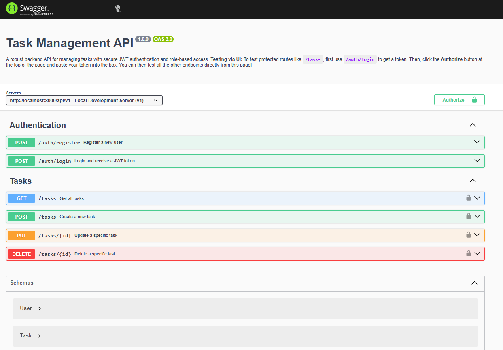

# TaskManager

A robust, highly scalable RESTful API and Web Portal designed for seamless task management. Built with a focus on enterprise-level security, modular architecture, and a dynamic server-side rendered UI.

This project goes beyond a simple CRUD application. It features strict role-based access control (RBAC), advanced JWT session management via HTTP-only cookies, robust Joi data validation, and a beautiful, fully responsive frontend powered by Tailwind CSS.

---

##  Tech Stack

### **Backend**
* **Runtime:** Node.js
* **Framework:** Express.js 5
* **Database:** MongoDB (with Mongoose ODM)
* **Authentication:** JSON Web Tokens (JWT) & bcryptjs
* **Security:** Helmet, Express Rate Limit, Mongo Sanitize

### **Frontend**
* **Templating:** EJS (Embedded JavaScript)
* **Styling:** Tailwind CSS (via PostCSS/Autoprefixer)
* **Interactivity:** Vanilla JS (Fetch API for seamless AJAX interactions)

### **Documentation & Devops**
* **API Docs:** Swagger UI (YAML) / Postman
* **Containerization:** Docker

---

##  Features

* **Secure User Authentication:** Registration and Login flows with bcrypt password hashing.
* **Stateless Sessions:** JWT-based authentication stored securely in `httpOnly` cookies.
* **Role-Based Access Control (RBAC):** Distinct permissions for `user` and `admin` roles. Admins can view and manage tasks globally.
* **AJAX CRUD Operations:** Create, Read, Update, and Delete tasks dynamically without full page reloads.
* **Global User Feedback:** Beautiful, self-dismissing Tailwind toast notifications for success/error alerts.
* **Strict Input Validation:** Joi schema validation enforcing data integrity before it reaches the database.
* **API Documentation:** Fully interactive Swagger UI integrated directly into the application.
* **Scalable Architecture:** Clean separation of concerns (Controllers, Services, Routes, Middlewares).

---

##  Project Structure

```text
src/
├── controllers/    # Handles HTTP request/responses and calls services
├── docs/           # Swagger YAML documentation
├── middlewares/    # Custom middlewares (Auth, Validation, Error Handling)
├── models/         # Mongoose Schemas (User, Task)
├── public/         # Static assets and compiled Tailwind CSS
├── routes/         # Express route definitions (API v1 & Views)
├── services/       # Core business logic and database interactions
├── validations/    # Joi validation schemas
├── views/          # EJS templates and partials (UI)
├── app.js          # Express app configuration & security setup
└── server.js       # Database connection and server initialization
```

---

##  Core API Endpoints

### **Authentication** (`/api/v1/auth`)
| Method | Endpoint | Description |
|---|---|---|
| `POST` | `/register` | Register a new user |
| `POST` | `/login` | Authenticate user and issue JWT |
| `GET` | `/logout` | Clear HTTP-only auth cookies |

### **Tasks** (`/api/v1/tasks`)
| Method | Endpoint | Description |
|---|---|---|
| `POST` | `/` | Create a new task |
| `GET` | `/` | Get all tasks (User sees own; Admin sees all) |
| `PUT` | `/:id` | Update task title, description, or status |
| `DELETE`| `/:id` | Delete a task |

---

##  Authentication Flow

1. **Login/Register:** The client sends credentials to the auth endpoints.
2. **Token Generation:** Upon success, the server signs a JWT containing the user's `_id` and `role`.
3. **Cookie Storage:** The JWT is injected into a strict `httpOnly` cookie, rendering it invisible to client-side JavaScript (preventing XSS attacks).
4. **Verification:** The `protect` middleware automatically intercepts incoming requests, reads the cookie, verifies the JWT signature, and attaches the `user` object to the request.

---

##  Setup Instructions

1. **Clone the repository**
   ```bash
   git clone https://github.com/princepandey3273/TaskManager.git
   ```

2. **Install Dependencies**
   ```bash
   npm install
   ```

3. **Environment Setup**
   Create a `.env` file in the root directory:
   ```env
   PORT=8000
   NODE_ENV=development
   MONGODB_URI=mongodb://localhost:27017/taskmanager
   JWT_SECRET=your_super_secret_jwt_key_here
   JWT_EXPIRES_IN=1d
   ```

4. **Run the Application**
   Open two terminals for development:
   ```bash
   # Terminal 1: Compile Tailwind CSS
   npm run watch:css

   # Terminal 2: Start the Node server
   npm start
   ```

---

##  Admin Access

We have pre-configured a global Admin account. Log in with these credentials to test Role-Based Access Control (Admins bypass user-ownership filters and can view/manage tasks from all users).

* **Email:** `admin@example.com`
* **Password:** `password123`

---

##  API Documentation 📚

This project features fully interactive Swagger documentation.
Once the server is running, simply navigate to:
**👉 [http://localhost:8000/api-docs](http://localhost:8000/api-docs)**

---

##  Security Features

* **Content Security Policy (CSP):** Configured via Helmet to prevent malicious script injections while safely allowing Google Fonts and EJS interactions.
* **Rate Limiting:** Prevents brute-force dictionary attacks on authentication endpoints.
* **NoSQL Injection Prevention:** Sanitizes incoming `$gt` / `$eq` queries.
* **XSS Protection:** HTTP-Only cookies ensure JWTs cannot be stolen via Cross-Site Scripting.

---

##  Scalability Considerations

* **Service Layer Pattern:** Business logic is entirely decoupled from controllers. This allows the backend to be easily adapted for Microservices or GraphQL.
* **Statelessness:** The backend relies purely on JWTs. There is no server-side session memory, making it trivial to horizontally scale across multiple instances behind a load balancer.
* **Ready for Redis:** The service layer is structured so that a Redis caching layer could be seamlessly injected into the `getTasks` service for massive read-heavy loads.

---

##  Future Improvements

* Implement cursor-based pagination for the Task List.
* Integrate SendGrid for email-based account verification and password resets.
* Add advanced filtering and searching (e.g., filter by `status` or date).
* Containerize MongoDB alongside the Node app using `docker-compose`.

---

##  Screenshots

### Interactive API Docs
> Built-in Swagger UI for testing REST endpoints.


---

**Crafted with ❤️ for modern web standards.**
